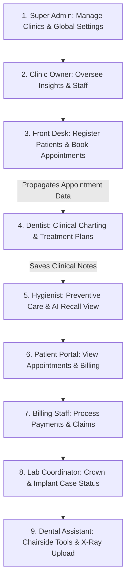

# Implementation Plan - Comprehensive Front-End Live Flow Testing

This plan outlines a complete step-by-step browser testing strategy across all 9 roles and all menus/sections in the system to verify the user flows, role-based access controls, and data travel (shared state across profiles).

## Proposed Test Flow

We will execute the testing sequentially in the browser using the preconfigured Sandbox Quick-Select Profiles. Each phase will test a specific persona and confirm that data propagates across the system.

---

### Phase 1: Global Admin Controls
**Role**: `Super Admin` (Email: `s.jenkins@hms-saas.com` / Password: `admin123`)
1. Log in using the Super Admin sandbox profile.
2. Navigate through the following sidebar menus:
   - **Dashboard (Global)**: Check system stats.
   - **Clinics Management**: View registered clinics.
   - **Clinic Owner**: Review approved owners list.
   - **Subscriptions & Billing**: Verify global SaaS plans.
   - **AI Settings**: Confirm global model configurations.
   - **Global Reports**: Review system-wide usage.
3. Log out.

### Phase 2: Operations Oversight
**Role**: `Clinic Owner` (Email: `owner@vancedental.com` / Password: `password123`)
1. Log in as Clinic Owner.
2. Navigate through:
   - **Dashboard**: View clinic revenue, doctor activity, and alerts.
   - **Patients Registry**: View patient profiles.
   - **Clinical Hub**: Review scheduled treatments.
   - **Billing Management**: Check local invoicing statuses.
   - **Staff Management**: View clinicians, hygienists, and front desk profiles.
   - **AI Insights**: Check revenue optimization metrics.
   - **AI Recall & Marketing**: Review campaign performance.
   - **AI Appointment Scheduler**: View the timeline, slot suggestions, and check edit/delete button visibility.
3. Log out.

### Phase 3: Patient Intake & Scheduling (Data Creation)
**Role**: `Front Desk` (Email: `amara.reception@vancedental.com` / Password: `password123`)
1. Log in as Front Desk.
2. Navigate to:
   - **Dashboard**: View checked-in patients and front desk tasks.
   - **Patient Registration**: Fill out the form to register a new test patient:
     - Name: `Jane Doe`
     - Age: `30`
     - Phone: `555-0199`
     - (This creates a new patient record in the global store).
   - **Insurance Verification**: Check verification queues.
   - **Waitlist**: View waitlist.
   - **AI Appointment Scheduler**:
     - Book a new appointment for `Jane Doe` with `Dr. Michael Chen` for Today at **10:00 AM** for a "Root Canal".
     - (This is the **Data Travel** point that propagates to the Dentist and Patient portals).
3. Log out.

### Phase 4: Clinical Work & Treatment Charting
**Role**: `Dentist` (Email: `dr.chen@vancedental.com` / Password: `password123`)
1. Log in as Dentist.
2. Verify that **Jane Doe's** appointment for **10:00 AM** appears on the Dentist Dashboard.
3. Navigate to **Patients Registry** and select **Jane Doe**:
   - View contextual sub-menus: **Clinical Charting**, **Treatment Plans**, **X-Rays**, **Prescriptions**, **Notes**.
   - Create a treatment plan: Add root canal recommendation.
   - Add a clinical note: "Left lower molar treatment needed."
   - (This clinical data travels to the Hygienist and Patient views).
4. Log out.

### Phase 5: Preventive Care & Recall Restrictions
**Role**: `Hygienist` (Email: `elena.r@vancedental.com` / Password: `password123`)
1. Log in as Hygienist.
2. Navigate to **AI Appointment Scheduler**:
   - Verify Jane Doe's appointment is shown in the schedule.
   - Verify that **Edit and Delete** buttons are hidden on Jane's booked card.
   - Verify that the warning alert banner is shown ("Hygienist View-Only Mode").
3. Navigate to **Recall List** and **AI Recall & Marketing** to verify view-only configurations.
4. Log out.

### Phase 6: Patient Portal Access
**Role**: `Patient` (Email: `james@gmail.com` / Password: `password123`)
1. Log in as Patient (using James Carter profile).
2. Navigate through:
   - **Dashboard**: View patient welcome page and treatment overview.
   - **Appointments**: Check upcoming scheduled visits and confirm appointment request inputs work.
   - **Treatment Plan**: View recommended therapies from dentist.
   - **Billing & Payments**: Review insurance claims and invoices.
3. Log out.

### Phase 7: Financial Management
**Role**: `Billing Staff` (Email: `billing@vancedental.com` / Password: `password123`)
1. Log in as Billing Staff.
2. Access the **Billing Hub**:
   - Review active invoices, claims queue, and payments history.
3. Log out.

### Phase 8: Lab Coordination
**Role**: `Lab Coordinator` (Email: `lab@vancedental.com` / Password: `password123`)
1. Log in as Lab Coordinator.
2. Navigate through:
   - **Lab Cases**: View case list.
   - **Crown Tracking / Implant Cases**: Monitor case progress.
   - **Status Board**: Review delivery dates.
3. Log out.

### Phase 9: Clinical Assistance
**Role**: `Dental Assistant` (Email: `assistant@vancedental.com` / Password: `password123`)
1. Log in as Dental Assistant.
2. Navigate through:
   - **Assigned Patients**: Check assistant tasks.
   - **X-Ray Upload**: Check file upload form inputs.
   - **Chairside Tools / Clinical Notes**: Check active dental tools.
3. Log out.

---

## Verification Plan

We will execute this comprehensive test flow using a browser subagent:
- Each page navigation will verify layout completeness and confirm there are no JavaScript runtime crashes.
- Screenshots and browser recordings (`.webp` animation videos) will capture the transitions and the data flow.
- A final verification matrix will document successful menu visits and data propagation.
